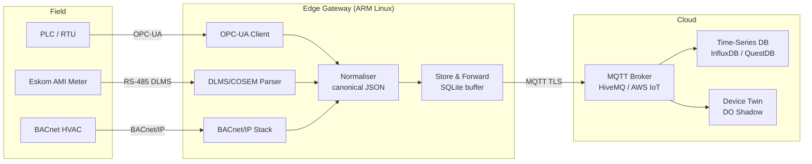
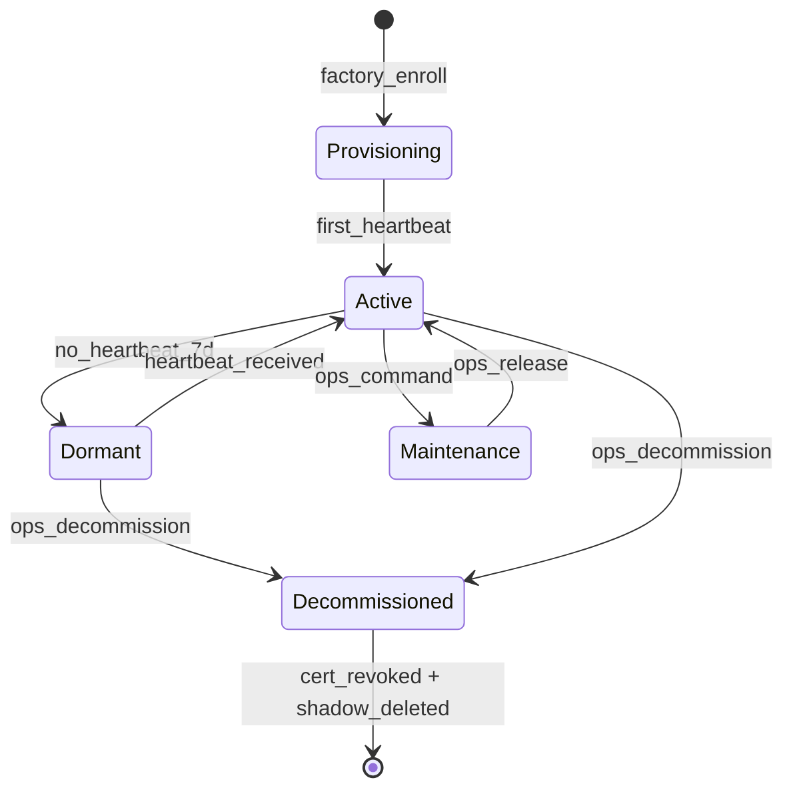

# IoT Platform & Cloud Integration

IoT platforms are the connective tissue between firmware running on constrained hardware and the business logic, dashboards, and data pipelines that make sensor data actionable. This skill covers the full platform stack — from device identity and provisioning through to dashboards and alerting — as a fractional IoT Engineering Director would apply it in production: opinionated, trade-off-aware, and grounded in what actually breaks in the field.

South African context is embedded throughout: Cloudflare's Johannesburg PoP (jnb01) for low-latency edge, Eskom AMI smart metering integration patterns, and load shedding resilience (store-and-forward, local buffering, graceful degradation when grid goes down).

---

## 1. IoT Platform Selection

### Platform Comparison

| Platform | Compute Model | MQTT | Device Shadow/Twin | Provisioning | Edge Runtime | Pricing Model | SA Latency |
|---|---|---|---|---|---|---|---|
| **AWS IoT Core** | Serverless rules engine | Native (MQTT 3.1.1 / 5.0) | IoT Shadow | Fleet Provisioning + claim certs | Greengrass v2 | Per-message + per-connection | ~160ms (Cape Town region) |
| **Azure IoT Hub** | PaaS | AMQP / MQTT / HTTPS | Device Twin | DPS (TPM/X.509/symmetric) | IoT Edge modules | Per-unit tier (F0 free, S1/S2/S3) | ~160ms (South Africa North) |
| **Google Cloud IoT** | Pub/Sub bridge | MQTT bridge (deprecated Mar 2023) | None native | Manual + JWKS | None native | **Deprecated** — migrate to 3rd party MQTT broker + Pub/Sub | N/A |
| **Cloudflare Workers + DO + KV** | Edge serverless | MQTT via DO (custom or HiveMQ Cloud relay) | DO storage as shadow | Custom provisioning endpoint | 200+ PoPs, zero cold start | Workers Paid ($5/mo base) | ~2ms from JNB (jnb01 PoP) |
| **ThingsBoard** | Spring Boot / self-host or cloud | Native MQTT broker | Device attributes | Tenant API + provisioning plugin | ThingsBoard Edge | Open-source or cloud $10/device/mo | Self-host: depends on your VPS region |
| **Losant** | Visual workflow (Node.js) | Native MQTT | Device state | CSV import / API | Edge Agent (Node.js) | Sandbox free; Startup $25/mo | US-east; no SA PoP |
| **HiveMQ** | MQTT-first broker | Native MQTT 3.1.1 / 5.0 | Extension SDK | HiveMQ Cloud free tier (100 connections) | HiveMQ Edge (OPC-UA, Modbus bridge) | Cloud: $0.00015/message | EU/US PoPs; relay to JNB via Workers |
| **Particle** | Hardware + cloud bundle | CoAP over cellular / Wi-Fi | Device variables + functions | Hardware-provisioned (device OS) | None (cloud-tethered) | $0.40/device/mo (cellular) | Routed through Particle cloud (US) |

### Selection Criteria Matrix

| Criterion | AWS IoT Core | Azure IoT Hub | CF Workers + DO | ThingsBoard | HiveMQ |
|---|---|---|---|---|---|
| MQTT 5 support | Yes | Partial | Via relay | Yes | Yes |
| Open-source / self-host | No | No | Composable | Yes (CE) | No (CE limited) |
| Edge offline resilience | Greengrass | IoT Edge | Store-and-forward in DO | Edge module | Edge extension |
| Multi-tenant / white-label | Limited | Limited | Full control | Yes (paid) | Extension SDK |
| OTA job management | IoT Jobs | ADU (Azure) | Custom via DO alarm | FOTA widget | Via extension |
| SA-local latency | ~160ms | ~160ms | ~2ms (JNB PoP) | Self-host: your choice | ~80ms via relay |
| Operational complexity | High | High | Medium (custom work) | Medium | Medium |
| Best for | Large enterprise, AWS-native teams | Azure-native enterprise | Edge-first, CF-native stacks | SMB / rapid dashboard | MQTT-pure, high-connection-count |

**Decision heuristic:** If you are already on AWS, use IoT Core + Greengrass. If you need sub-10ms edge latency in Southern Africa, Cloudflare Workers + Durable Objects is the only viable serverless answer. If you need dashboards out of the box with multi-tenant support and modest device count (<50k), ThingsBoard CE self-hosted on a Hetzner VPS in Johannesburg wins on cost.

---

## 2. Device Provisioning & Identity

### X.509 Certificate Hierarchy

Every production IoT deployment needs a CA hierarchy. Never use a flat self-signed cert per device — you cannot rotate or revoke at scale.

```
Root CA  (offline HSM, air-gapped)
  └── Intermediate CA  (online, used for signing device certs)
         └── Device Certificate  (one per device, provisioned at factory or in-field)
```

**PKIX fields for device certificates:**

```
Subject: CN=<device-serial-number>, O=YourOrg, C=ZA
SubjectAltName: URI=urn:devices:fleet:<fleet-id>:device:<serial>
KeyUsage: digitalSignature, keyEncipherment
ExtendedKeyUsage: clientAuth
ValidityPeriod: 10 years (hardware lifetime) or 1 year (rotate via SCEP/EST)
```

### Factory Provisioning vs In-Field Enrollment

| Method | When | Tooling | Risk |
|---|---|---|---|
| Factory injection | HSM or provisioning jig writes cert + key at manufacture | AWS IoT Fleet Provisioning, custom SCEP server | Private key never on network (best) |
| In-field enrollment (TOFU) | Device generates key pair on first boot; sends CSR to provisioning endpoint | ACME / EST / custom API | CSR must be authenticated (claim token, physical button press, QR code scan) |
| Symmetric key (shared secret) | Dev/test only — never production | AWS IoT symmetric key policy | One compromised device = all devices compromised |

### AWS Fleet Provisioning (Claim Certificate Flow)

```
Device (factory-loaded claim cert)
  → MQTT connect to AWS IoT Core with claim cert
  → Publish to $aws/certificates/create/json
  → Receive: certificatePem, privateKey, certificateId
  → Publish to $aws/provisioning-templates/<template>/provision/json
      payload: { certificateOwnershipToken, parameters: { SerialNumber: "SN-12345" } }
  → Receive: thingName, thingArn, deviceConfiguration
  → Disconnect; reconnect with newly issued device cert
```

Provisioning template (IAM-controlled):

```json
{
  "Parameters": {
    "SerialNumber": { "Type": "String" }
  },
  "Resources": {
    "thing": {
      "Type": "AWS::IoT::Thing",
      "Properties": {
        "ThingName": { "Ref": "SerialNumber" },
        "ThingGroups": ["production-fleet"]
      }
    },
    "certificate": {
      "Type": "AWS::IoT::Certificate",
      "Properties": { "CertificateId": { "Ref": "AWS::IoT::Certificate::Id" } }
    },
    "policy": {
      "Type": "AWS::IoT::Policy",
      "Properties": { "PolicyName": "DevicePolicy" }
    }
  }
}
```

### Azure DPS (Device Provisioning Service)

Three attestation mechanisms:

| Mechanism | Use case | Security level |
|---|---|---|
| X.509 CA enrollment group | Factory-provisioned certs from your CA | Highest |
| TPM individual enrollment | TPM 2.0 chip on device | High (hardware-bound) |
| Symmetric key group | Dev/test, low-cost devices | Low — avoid in production |

### Certificate Rotation Lifecycle

```
[Issued] → [Active] → [Expiring (90 days warning)] → [Rotation pending]
                                                           ↓
                                                    [New cert issued via EST/SCEP]
                                                           ↓
                                                    [Old cert revoked] → [CRL / OCSP updated]
```

Rotation trigger: either time-based (X days before expiry) or event-based (compromise detected). Always use a two-step rotate: new cert active + old cert valid for 24h overlap to survive in-flight reconnects.

### TPM 2.0 Basics

TPM 2.0 provides a hardware root of trust — private keys are generated inside the TPM and never leave. The TPM endorsement key (EK) is factory-provisioned by the chip manufacturer and can be verified against the manufacturer's EK certificate chain.

For IoT: use the TPM's `TPM2_CreatePrimary` + `TPM2_Create` hierarchy to generate a device attestation key. The public portion becomes the device identity; the private portion never exits the TPM boundary. Azure DPS TPM attestation uses this to prove device identity without exposing any secret.

---

## 3. Device Shadow / Digital Twin

### Shadow Pattern

The shadow (AWS) or device twin (Azure) is a JSON document that decouples the cloud's desired state from the device's reported state. The device does not need to be online for the cloud to accept a state change.

```
Shadow document structure:
{
  "state": {
    "desired": {
      "led": "on",
      "reporting_interval_s": 30
    },
    "reported": {
      "led": "off",
      "reporting_interval_s": 60,
      "firmware_version": "2.1.4",
      "battery_pct": 78
    },
    "delta": {
      "led": "on",
      "reporting_interval_s": 30
    }
  },
  "metadata": { ... },
  "version": 42,
  "timestamp": 1711900000
}
```

**Delta**: auto-computed by the platform — only keys where desired != reported. Device subscribes to `$aws/things/<name>/shadow/update/delta` and acts on the delta. On reconnect after offline period, device GETs current shadow and applies any pending delta.

### Conflict Resolution

| Conflict | Resolution |
|---|---|
| Device sends stale reported state (old version) | Platform rejects if version < current; device must GET latest then re-report |
| Two cloud processes write desired simultaneously | Last writer wins (optimistic concurrency); use version field to detect and retry |
| Device cannot achieve desired state | Report `"status": "error"` in reported with reason; surface in alerting |

### Azure Device Twin: Tags vs Properties

- **Tags**: written by the solution backend only; not visible to device. Use for metadata: `location`, `customer_id`, `firmware_cohort`. Query devices by tag for bulk operations.
- **Desired properties**: written by backend; read by device. Use for configuration.
- **Reported properties**: written by device; read by backend. Use for telemetry metadata and state.

### Industrial Digital Twin — Asset Model Hierarchy

```
Fleet
  └── Site  (e.g. Eskom substation Johannesburg North)
         └── Gateway  (edge device, aggregates downstream sensors)
                └── Device  (e.g. energy meter, RTU)
                       └── Sensor / Data Point  (e.g. voltage_V, current_A, power_kW)
```

Each level has its own twin document. The gateway twin reflects aggregated health. The device twin reflects individual device state. The site twin reflects roll-up KPIs (total power consumption, alert count).

### OPC-UA Basics for Industrial Integration

OPC-UA (IEC 62541) is the standard for industrial device communication. Key concepts:

- **Node**: every data point is a node in an address space tree (NodeId: `ns=2;i=1001`)
- **Subscription**: client subscribes to node changes with a publishing interval (not polling per-request)
- **Security mode**: `None` / `Sign` / `SignAndEncrypt` — always `SignAndEncrypt` in production
- **Method nodes**: callable functions on the device (e.g., `ResetAlarm`, `StartCalibration`)

Protocol translation pattern: OPC-UA Server (on PLC/RTU) → OPC-UA Client (on gateway) → MQTT publish → broker → cloud twin update. HiveMQ Edge and AWS IoT SiteWise both ship OPC-UA connectors.

---

## 4. Time-Series Data

### Database Comparison

| DB | Model | Query Language | Ingestion (single node) | Compression | Best For |
|---|---|---|---|---|---|
| **InfluxDB v2/3** | Measurement / tag / field | Flux (v2), SQL (v3) | ~300k points/s | ~10:1 (LZ4+delta) | General IoT telemetry, alerting, Grafana-native |
| **TimescaleDB** | PostgreSQL hypertable | SQL + time_bucket() | ~100k rows/s | ~20:1 (columnar compression) | Mixed IoT + relational queries, existing Postgres team |
| **QuestDB** | Columnar, append-only | SQL (ANSI + extensions) | ~1.4M rows/s | ~15:1 | High-frequency ingestion (energy meters, vibration sensors) |
| **Prometheus** | Time-series (pull) | PromQL | ~1M samples/s | ~1.3 bytes/sample | Infrastructure metrics, alerting, short retention |
| **VictoriaMetrics** | Prometheus-compatible | MetricsQL (superset) | ~3M samples/s | ~0.8 bytes/sample (best in class) | High-cardinality, long retention, Prometheus replacement |

### InfluxDB Measurement/Tag/Field Model

```
measurement: energy_meter
tags (indexed, low cardinality): device_id=EM-1042, site=JNB-NORTH, phase=L1
fields (not indexed, numeric/string): voltage_V=231.4, current_A=12.8, power_kW=2.96
timestamp: 2024-03-01T06:00:00Z
```

Tags are indexed — filter by tag, not field. Fields are the measurements. Never put high-cardinality values (user IDs, UUIDs) in tags — it blows up the series cardinality and kills performance.

**Flux query — 5-minute average power with downsampling:**

```flux
from(bucket: "iot-telemetry")
  |> range(start: -24h)
  |> filter(fn: (r) => r._measurement == "energy_meter" and r._field == "power_kW")
  |> filter(fn: (r) => r.site == "JNB-NORTH")
  |> aggregateWindow(every: 5m, fn: mean, createEmpty: false)
  |> yield(name: "mean_power")
```

**Retention policy + downsampling:**

```flux
// Task: downsample raw 10s data to 5min aggregates, retain raw for 7 days
option task = { name: "downsample_energy", every: 5m }

data = from(bucket: "iot-raw")
  |> range(start: -10m)
  |> filter(fn: (r) => r._measurement == "energy_meter")
  |> aggregateWindow(every: 5m, fn: mean)

data |> to(bucket: "iot-5min", org: "your-org")
```

### TimescaleDB Hypertable + Continuous Aggregate

```sql
-- Create hypertable (chunk by 1 day)
SELECT create_hypertable('energy_readings', 'time', chunk_time_interval => INTERVAL '1 day');

-- Continuous aggregate: 5-minute mean power per device
CREATE MATERIALIZED VIEW energy_5min
WITH (timescaledb.continuous) AS
SELECT
  time_bucket('5 minutes', time) AS bucket,
  device_id,
  AVG(power_kw) AS mean_power_kw,
  MAX(power_kw) AS peak_power_kw
FROM energy_readings
GROUP BY bucket, device_id;

-- Refresh policy
SELECT add_continuous_aggregate_policy('energy_5min',
  start_offset => INTERVAL '10 minutes',
  end_offset   => INTERVAL '5 minutes',
  schedule_interval => INTERVAL '5 minutes');
```

### When to Use Each

- **InfluxDB**: default choice for IoT telemetry. Rich ecosystem, Grafana datasource, Telegraf agent for collection. Use v3 (SQL) for new projects.
- **TimescaleDB**: when you need time-series AND relational queries in the same DB. Device metadata, alerts, and telemetry in one Postgres instance. Good for teams who know SQL.
- **QuestDB**: when ingestion rate is the bottleneck. High-frequency sensors (vibration, power quality, AMI pulse data). SQL is familiar.
- **Prometheus**: infrastructure monitoring (gateways, servers, Kubernetes pods). Not suited for long retention or high-cardinality device telemetry — use VictoriaMetrics instead.
- **VictoriaMetrics**: Prometheus at scale. Drop-in replacement. Use when Prometheus storage becomes the bottleneck or you need >1 year retention.

---

## 5. Edge Computing

### Edge vs Cloud Trade-off

| Dimension | Edge | Cloud |
|---|---|---|
| Latency | <1ms local | 100–300ms round-trip |
| Bandwidth cost | Minimal (process locally, send summary) | High (stream all raw data) |
| Offline resilience | Operates independently during WAN outage | No WAN = no processing |
| Compute cost | Fixed (hardware purchase) | Variable (per-message/per-compute) |
| Updates | OTA required; rollback risk | Instant deploy, no device risk |
| ML inference | TFLite / ONNX on device | Full model, GPU available |

**Load shedding resilience (SA-specific):** During Eskom Stage 4–6 (4–8h blackouts), gateways on UPS must continue processing. Design for: 4h battery autonomy, store-and-forward buffer of 72h of compressed telemetry, reconnect-and-flush on power restoration with exponential backoff.

### AWS Greengrass v2 Architecture

```
Greengrass nucleus (systemd service on Linux gateway)
  ├── Component: StreamManager   (local MQTT → S3/Kinesis buffer)
  ├── Component: Shadow sync     (local device shadows ↔ IoT Core)
  ├── Component: ML inference    (TFLite component for local anomaly detection)
  └── Component: Your custom app (deployed via GDK CLI or console)
```

Component recipe example (YAML):

```yaml
RecipeFormatVersion: "2020-01-25"
ComponentName: com.yourorg.energy-monitor
ComponentVersion: "1.2.0"
ComponentDependencies:
  aws.greengrass.StreamManager:
    VersionRequirement: ">=2.0.0"
Manifests:
  - Platform:
      os: linux
    Lifecycle:
      Run: "python3 {artifacts:path}/monitor.py"
    Artifacts:
      - URI: s3://your-bucket/components/energy-monitor/1.2.0/monitor.py
```

### Azure IoT Edge Modules + Routes

```
IoT Edge runtime
  ├── edgeAgent (manages module lifecycle)
  ├── edgeHub   (local message broker; stores-and-forwards to IoT Hub)
  ├── Module: OpcUaBridge   (reads PLC data via OPC-UA)
  ├── Module: Normaliser    (canonical schema transformation)
  └── Module: AnomalyDetect (ONNX model, local inference)

Routes:
  OpcUaBridge → Normaliser → edgeHub → upstream (IoT Hub)
  AnomalyDetect → edgeHub → upstream (alerts only)
```

Deployment manifest snippet:

```json
{
  "modulesContent": {
    "$edgeHub": {
      "properties.desired": {
        "routes": {
          "OpcToNorm": "FROM /messages/modules/OpcUaBridge/outputs/raw INTO BrokeredEndpoint(\"/modules/Normaliser/inputs/raw\")",
          "NormToCloud": "FROM /messages/modules/Normaliser/outputs/normalised INTO $upstream"
        },
        "storeAndForwardConfiguration": { "timeToLiveSecs": 86400 }
      }
    }
  }
}
```

### Cloudflare Workers at the Edge (IoT Pattern)

Cloudflare Workers run at 200+ PoPs including Johannesburg (jnb01). Zero cold start means the first MQTT message from a device incurs no startup penalty.

```
Device (MQTT) → HiveMQ Cloud (or self-hosted broker)
                     → MQTT webhook / REST bridge
                           → Cloudflare Worker (ingest endpoint)
                                 → Durable Object (per-device shadow state)
                                 → KV (device config / feature flags)
                                 → Analytics Engine (time-series metrics)
                                 → R2 (raw telemetry archive)
```

Durable Object as device shadow (TypeScript):

```typescript
import { DurableObject } from 'cloudflare:workers';

interface DeviceShadow {
  desired: Record<string, unknown>;
  reported: Record<string, unknown>;
  version: number;
  lastSeen: number;
}

export class DeviceShadowDO extends DurableObject {
  async updateReported(deviceId: string, reported: Record<string, unknown>): Promise<DeviceShadow> {
    const shadow = (await this.ctx.storage.get<DeviceShadow>('shadow')) ?? {
      desired: {}, reported: {}, version: 0, lastSeen: 0
    };
    shadow.reported = { ...shadow.reported, ...reported };
    shadow.version += 1;
    shadow.lastSeen = Date.now();
    await this.ctx.storage.put('shadow', shadow);
    return shadow;
  }

  async setDesired(desired: Record<string, unknown>): Promise<void> {
    const shadow = (await this.ctx.storage.get<DeviceShadow>('shadow')) ?? {
      desired: {}, reported: {}, version: 0, lastSeen: 0
    };
    shadow.desired = { ...shadow.desired, ...desired };
    shadow.version += 1;
    await this.ctx.storage.put('shadow', shadow);
  }

  async getDelta(): Promise<Record<string, unknown>> {
    const shadow = await this.ctx.storage.get<DeviceShadow>('shadow');
    if (!shadow) return {};
    const delta: Record<string, unknown> = {};
    for (const [k, v] of Object.entries(shadow.desired)) {
      if (JSON.stringify(shadow.reported[k]) !== JSON.stringify(v)) delta[k] = v;
    }
    return delta;
  }
}
```

### Local Inference: TFLite / ONNX / Edge Impulse

| Runtime | Target | Model size | Latency | SA use case |
|---|---|---|---|---|
| TensorFlow Lite | Linux gateway (ARM/x86) | 1–100MB | 10–500ms | Anomaly detection on power quality waveforms |
| ONNX Runtime | Linux/Windows gateway | 1–500MB | 5–300ms | Predictive maintenance on vibration FFT features |
| Edge Impulse SDK | MCU (Cortex-M4+) | 10–200KB | <10ms | On-device gesture / vibration classification without gateway |

Rule: **infer at the lowest tier that meets latency requirements**. Sending raw 3-axis vibration at 1kHz to the cloud for FFT + inference costs ~50MB/h per sensor. Running FFT + ONNX on the gateway reduces that to ~1KB/h (anomaly boolean + confidence score).

### Protocol Translation

```
Modbus RTU (RS-485)  → Modbus TCP  → HiveMQ Edge connector  → MQTT
OPC-UA (TCP port 4840) → OPC-UA client on gateway → MQTT publish
BACnet/IP (UDP 47808)  → Node-RED BACnet node → MQTT publish
DLMS/COSEM (Eskom AMI) → libdlms-devel / gurux-dlms → REST → MQTT
```

Mermaid architecture: protocol translation layer



---

## 6. IoT Data Pipeline

### Ingestion Patterns

```
Pattern A — Direct subscribe:
  Device → MQTT broker → subscriber service → time-series DB
  Latency: low. Throughput: limited by subscriber concurrency. Simple.

Pattern B — Stream processor:
  Device → MQTT broker → Kafka (MQTT source connector) → stream processor (Flink/KSQL) → DB
  Latency: medium. Throughput: very high. Handles spikes. Complex.

Pattern C — Cloudflare edge pipeline:
  Device → MQTT broker → Worker (HTTP bridge) → Analytics Engine (hot) + R2 (archive)
  Latency: ~2ms ingest at JNB PoP. No broker ops. Serverless.
```

### Kafka for High-Throughput IoT

- **Topic per device type** (not per device): `energy.meters.raw`, `vibration.sensors.raw`. Per-device topics at 10k devices = 10k topics = Kafka operator's nightmare.
- **Compacted topics for state**: device shadow updates should use log compaction — only the latest value per device key is retained. Useful for cold-start replay.
- **Partitioning key**: use `device_id` as the Kafka message key to ensure all messages from one device land in the same partition (ordered processing per device).
- **Consumer groups**: one per downstream — `timeseries-writer`, `alert-evaluator`, `digital-twin-sync` each consume independently.

```
Topic: energy.meters.raw  (partitions: 12, replication: 3, retention: 7 days)
  Key:   device_id (e.g., "EM-1042")
  Value: { "ts": 1711900000, "device_id": "EM-1042", "voltage_V": 231.4, "current_A": 12.8, "power_kW": 2.96 }
```

### Node-RED for Low-Code Pipeline Prototyping

Node-RED is the fastest way to wire up an IoT pipeline for a proof of concept or a small production deployment (<1k devices). Use it for:

- MQTT subscribe → InfluxDB write (10-node flow, 30 minutes)
- MQTT subscribe → webhook → Slack alert
- Serial/Modbus → MQTT publish (protocol bridge)
- CSV file import → device provisioning API

Do not use Node-RED for: >10k msg/s ingestion, complex stream processing, production deployments that need CI/CD and version control discipline (flows are JSON, hard to diff).

### Telegraf for Metrics Collection

Telegraf (InfluxData) is the production-grade alternative: 300+ input plugins, 50+ output plugins, runs as a systemd service on the gateway or as a sidecar on the ingestion server.

```toml
# telegraf.conf on edge gateway
[agent]
  interval = "10s"
  flush_interval = "10s"

[[inputs.mqtt_consumer]]
  servers = ["tcp://mqtt.yourplatform.co.za:1883"]
  topics = ["devices/+/telemetry"]
  data_format = "json"
  json_time_key = "ts"
  json_time_format = "unix"
  tag_keys = ["device_id", "site"]

[[outputs.influxdb_v2]]
  urls = ["https://influxdb.yourplatform.co.za"]
  token = "$INFLUX_TOKEN"  # from env, never hardcode
  org = "your-org"
  bucket = "iot-telemetry"
```

### Normalisation: Device-Specific Payload → Canonical Schema

Raw payloads vary per manufacturer. Define a canonical schema and transform at the gateway or at the ingestion worker:

```typescript
// Canonical telemetry event
interface TelemetryEvent {
  device_id: string;          // URN: urn:devices:<fleet>:<serial>
  timestamp_ms: number;       // Unix ms, UTC
  schema_version: string;     // "1.0"
  measurements: Record<string, number>;  // SI units: voltage_V, current_A, power_kW
  metadata?: {
    firmware_version?: string;
    signal_rssi?: number;
    battery_pct?: number;
  };
}

// Transformer for Schneider PM5300 meter payload
function normaliseSchneiderPM5300(raw: SchneiderPayload): TelemetryEvent {
  return {
    device_id: `urn:devices:energy:${raw.serialNumber}`,
    timestamp_ms: raw.unixTimestamp * 1000,
    schema_version: "1.0",
    measurements: {
      voltage_V: raw.V_L1_N,
      current_A: raw.I_L1,
      power_kW: raw.P_total / 1000,
      power_factor: raw.PF,
      frequency_Hz: raw.freq,
    },
    metadata: { firmware_version: raw.fw }
  };
}
```

### Storage Tiering

```
Hot   (0–7 days)    → InfluxDB / QuestDB        — full resolution, fast query, expensive per GB
Warm  (7–90 days)   → TimescaleDB / InfluxDB     — 5-min aggregates, moderate cost
Cold  (90d–7 years) → Parquet files on R2 / S3   — compressed columnar, query via DuckDB/Athena
```

Tiering pipeline:

```
InfluxDB task (runs nightly):
  1. Aggregate raw 10s → 5min for previous day
  2. Write to warm bucket
  3. Export raw previous day to Parquet → upload to R2
  4. Delete raw data older than 7 days from hot bucket
```

---

## 7. Fleet Management

### OTA Job Orchestration

Never push firmware to all devices simultaneously. Use a canary rollout:

```
Rollout strategy:
  Stage 1: Canary     — 1% of fleet (lab devices + volunteer early adopters)
           Hold 24h. Monitor: crash rate, memory usage, RSSI, heartbeat.
  Stage 2: Early      — 10% of fleet (by device cohort: oldest firmware first)
           Hold 48h. Monitor: same + customer support ticket rate.
  Stage 3: General    — 50% of fleet
           Hold 24h.
  Stage 4: Full       — 100% of fleet
```

Rollback triggers (automated):

```
IF crash_rate > 2%              THEN pause rollout, alert on-call
IF heartbeat_timeout_rate > 5%  THEN pause rollout, alert on-call
IF memory_usage > 90%           THEN pause rollout
IF manual override by ops       THEN rollback to previous version
```

### Device Health Monitoring

```
Heartbeat: device publishes to devices/<id>/heartbeat every 60s
  Payload: { ts, firmware_version, uptime_s, free_heap, rssi, battery_pct }

Platform-side timeout detection:
  KV key: heartbeat:<device_id> with TTL = 180s
  If key expires → trigger alert "device offline >3min"
  If key missing at startup → trigger "device never connected"
```

### Device Lifecycle States



### Bulk Operations

Group devices by tag (firmware version, customer, site) and apply operations to the group:

```sql
-- TimescaleDB: find all devices on firmware < 2.1.0 at JNB sites
SELECT device_id, firmware_version, last_seen
FROM device_registry
WHERE firmware_version < '2.1.0'
  AND site LIKE 'JNB-%'
  AND lifecycle_state = 'active'
ORDER BY last_seen DESC;
```

Then submit an OTA job targeting that cohort. AWS IoT Jobs supports `thingGroupTargets` for this. Azure IoT Hub uses device twin tag queries for job targeting.

### Remote Diagnostics

- **Shell-over-MQTT**: subscribe to `devices/<id>/cmd/shell`, publish command, subscribe to `devices/<id>/cmd/shell/response`. Secured by device-level ACL (broker policy). Log all commands to audit trail.
- **Log streaming**: device streams syslog or application logs to `devices/<id>/logs` during a diagnostic session. TTL-bounded (auto-stop after 10 minutes to prevent bandwidth drain).
- **Remote reboot**: publish `{ "action": "reboot", "token": "<signed-jwt>" }` to `devices/<id>/cmd/control`. Device validates JWT signature before acting.

---

## 8. Dashboards & Alerting

### Grafana Setup for IoT

Standard IoT Grafana stack:

```
InfluxDB v2 → Grafana datasource (Flux or InfluxQL)
Prometheus  → Grafana datasource (PromQL)
CF Analytics Engine → Grafana datasource (via CF API)
```

Key panel types for IoT:

| Panel | Use case |
|---|---|
| Time series | Voltage, current, power over time |
| Stat / Gauge | Current value, battery %, uptime |
| Geomap | Device location + health status by site |
| Table | Fleet overview: device_id, firmware, last_seen, status |
| Heatmap | Hourly load profile across the fleet |
| Histogram | Latency distribution, RSSI distribution |
| Alert list | Active alerts with severity and duration |

**Grafana alerting rule example (InfluxDB, power factor below threshold):**

```
Alert: Low Power Factor
Condition: mean(power_factor) over last 15m < 0.85
           for device in site=JNB-NORTH
Severity: warning
Labels: { site: "JNB-NORTH", team: "energy-ops" }
Annotations:
  summary: "Power factor degraded on {{ $labels.device_id }}"
  description: "PF = {{ $values.A.Value | printf \"%.2f\" }} — check capacitor bank"
Contact point: PagerDuty (business hours) → OpsGenie on-call (after hours)
```

### Grafana + Cloudflare Analytics Engine

Cloudflare Analytics Engine (AE) is the native time-series store for Workers-generated metrics. Write from a Worker:

```typescript
// In your ingest Worker
env.AE.writeDataPoint({
  blobs: [deviceId, siteId],
  doubles: [voltageV, currentA, powerKW],
  indexes: [deviceId],  // high-cardinality index
});
```

Query via AE SQL API and expose as a Grafana datasource using the Cloudflare datasource plugin or a custom proxy Worker.

### ThingsBoard Dashboards

ThingsBoard's dashboard builder is drag-and-drop with a wide widget library. Key features for IoT:

- **Multi-tenant**: each customer sees only their devices' dashboards (tenant isolation at DB level)
- **White-label**: custom logo, colours, domain — suitable for reselling to SA utilities and industrial customers
- **Real-time push**: WebSocket-based widget updates — no polling
- **Mobile PWA**: dashboards are responsive; deployable as PWA for field technician tablets

### Alerting Hierarchy

```
Device
  → Gateway  (local alert: loss of downstream device)
       → Platform  (MQTT broker / ingestion service alert)
            → Operations Team  (PagerDuty / OpsGenie / WhatsApp Business API)
```

Escalation runbook:

```
Level 1 (Auto-resolve, <5min):  device offline <5min → log only, no page
Level 2 (Warning, 5–30min):     device offline 5–30min → Slack alert to #iot-ops
Level 3 (Critical, >30min):     device offline >30min → PagerDuty P3 → on-call eng
Level 4 (Site down, >1h):       >20% of site devices offline → P1, escalate to IoT Director
Level 5 (Fleet event):          >5% of fleet offline simultaneously → incident bridge opened
                                  (likely Eskom load shedding — check schedule first)
```

**Load shedding false positive suppression (SA-specific):**

```typescript
// Before paging on mass device offline — check Eskom schedule
async function isLoadSheddingActive(siteGps: { lat: number; lon: number }): Promise<boolean> {
  // EskomSePush API (https://eskomsepush.gumroad.com/l/api)
  const response = await fetch(
    `https://developer.sepush.co.za/business/2.0/check?lat=${siteGps.lat}&lon=${siteGps.lon}`,
    { headers: { token: env.ESP_API_TOKEN } }
  );
  const data = await response.json();
  return data.schedule?.status === 'active';
}

// Suppress page if load shedding is active and >80% of offline devices are in affected area
```

---

## Common Gotchas

- **Tag cardinality kills InfluxDB**: device UUIDs in tag keys grow the series cardinality unboundedly. Use `device_id` as a tag only if your fleet is <100k devices; otherwise use as a field and create a separate device registry table. Monitor `SHOW SERIES CARDINALITY` weekly.
- **MQTT QoS 0 loses data during WAN outages**: QoS 0 (fire-and-forget) is fine for high-frequency non-critical telemetry, but never use it for alarms, OTA job acknowledgements, or billing-grade metering data. Use QoS 1 (at-least-once) with idempotent consumers (deduplicate by `msg_id`). QoS 2 (exactly-once) has 4-way handshake overhead — avoid unless strictly necessary.
- **Device shadow version conflicts during reconnect**: on reconnect, always GET the current shadow before publishing reported state. Sending a stale version causes a `VersionConflict` rejection. Pattern: connect → GET shadow → apply delta → publish reported.
- **Certificate rotation breaks in-field devices**: if your cert rotation procedure requires a reboot or a maintenance window, budget for it in the OTA schedule. Devices that miss a rotation window end up with expired certs and can no longer connect — recovery requires physical access or a pre-provisioned fallback cert on a separate topic (`$aws/certificates/create/json`).
- **Kafka per-device topics**: this anti-pattern creates thousands of topics, each with its own partition metadata. Kafka brokers struggle above ~50k topics. Always partition by device type or fleet segment, not by device ID.
- **Load shedding + store-and-forward flush stampede**: when Eskom restores power, every device reconnects and flushes its buffer simultaneously. Stagger reconnect (add `random_jitter_ms = rand(0, 300000)` to firmware reconnect logic) and size your ingestion pipeline for 10x normal throughput for the first 10 minutes post-restoration.
- **OPC-UA security mode `None` in production**: scans of industrial networks routinely find OPC-UA servers with no authentication and no encryption. This is a critical vulnerability in Eskom AMI and substation automation deployments. Enforce `SignAndEncrypt` at the platform level and fail device provisioning if the security mode negotiation downgrades.
- **Grafana alert flapping**: an alert that fires and resolves within a single evaluation cycle generates noise and alert fatigue. Always set a `for` duration (minimum 5 minutes for device offline alerts) to require the condition to be sustained before firing.

---

## SA-Specific Considerations

### Cloudflare Johannesburg PoP (jnb01)

The Johannesburg PoP (jnb01) is active on Cloudflare's network. Workers deployed globally run at jnb01 for SA-origin traffic. This means:

- Device → Worker round-trip: ~2ms (from Johannesburg co-lo)
- MQTT-over-WebSocket to a Durable Object named by device serial: consistent low-latency shadow updates
- Analytics Engine writes from SA devices: land in jnb01 first, replicated globally

For an Eskom AMI deployment: 10,000 meters × 1 reading/15min = 11 msg/s average, 200 msg/s burst at 15-min boundary. Cloudflare Workers handles this trivially; the cost is ~$0.15/day at standard pricing.

### Eskom AMI Smart Metering

- Protocol: DLMS/COSEM over PLC (PRIME or G3-PLC) or cellular (NB-IoT)
- Standard: IEC 62056 (DLMS) + EN 13757 (M-Bus)
- Key data points: active energy (kWh import/export), reactive energy (kVARh), instantaneous power (kW), voltage per phase, current per phase, power quality events (sag, swell, outage timestamps)
- Head-end system integration: typically via IEC 61968-9 (MultiSpeak) or proprietary Kamstrup/Landis+Gyr API
- Token-based prepaid: STS (Standard Transfer Specification, IEC 62055-41) for token generation; device accepts 20-digit tokens over keypad or DLMS method call

### Load Shedding Resilience Architecture

```
Normal operation:
  Device → MQTT (TLS) → Broker → Ingest → InfluxDB → Grafana

During load shedding (WAN down, gateway on UPS):
  Device → MQTT (local broker on gateway) → SQLite buffer
  [power restored]
  SQLite buffer → flush to cloud MQTT → Ingest → InfluxDB
  [flush complete]
  Resume normal operation
```

SQLite store-and-forward sizing: 72h × 10 devices × 1 reading/10s × 200 bytes/reading ≈ 43MB. Easily fits on a 4GB SD card or eMMC. Flush strategy: oldest-first, batch 100 messages, 500ms between batches to avoid stampede.

---

## See Also

- [iot/connectivity](../connectivity/SKILL.md) — MQTT protocol, TLS, cellular, LoRaWAN, NB-IoT
- [iot/firmware](../firmware/SKILL.md) — OTA update mechanics, bootloader, memory layout
- [tech/cloudflare/durable-objects](../../tech/cloudflare/durable-objects/SKILL.md) — stateful edge for device shadow pattern
- [tech/cloudflare/analytics-engine](../../tech/cloudflare/analytics-engine/SKILL.md) — edge-native time-series for Workers
- [tech/architecture](../../tech/architecture/SKILL.md) — ADR generation, trade-off analysis
